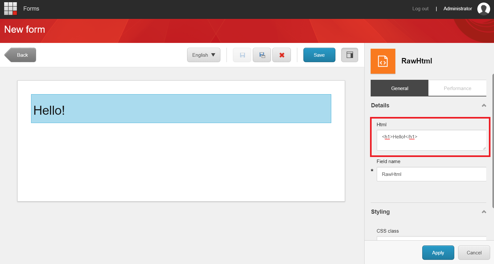

========
Raw HTML
========

With the Raw HTML component you can add unescaped content onto your form. 
This allows to add small custom javascripts or some custom tailered html snippets on your form.

Draw the Raw HTML component on the form. Select the component and add html in the HTML field.

