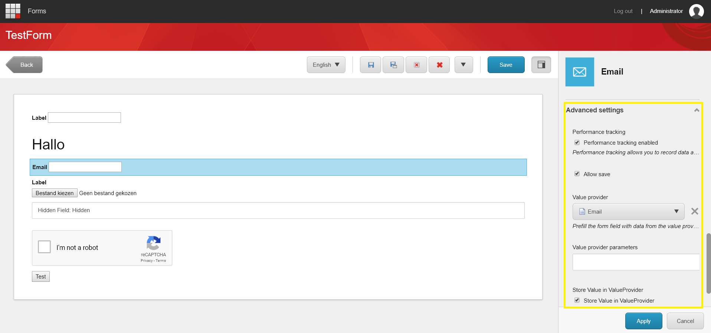
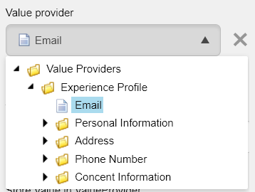

.. _FormBindings:

==========================
Form Bindings (Prefilling)
==========================

With the form bindings, you an prefill fields in your form based on xDB contact data. 
The form bindings also support to store the data entered in the form on your xDB contact.

How to configure a field
========================

In the forms editor, select the field you wish to prefill.

Check the "Advanced" section in the panel on the right.

Value Provider
--------------
**Mandatory**

In the value provider field, you must select what source you want to link the field to. 
The prefill value of the form will be fetched form this source.

Store Value
-----------
**Optional**

Check the "store value" checkbox in order to save the value entered by the visitor in the form to the selected source.
