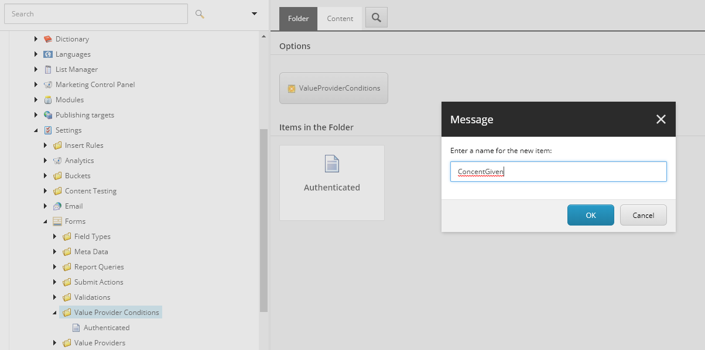

.. _ValueProviderConditions:

=========================
Value Provider Conditions
=========================

When a visitor browses to your site, we might already have a lot of information on him based on his xDB tracking cookie.
When prefilling of forms is enabled by use of the fieldbindings, we can prefill the form fields from xDB.
This might not always be the desired behaviour, there may be cases where you only want to prefill when a user is logged in, or has given concent to prefill the form.

With the Value Provider Conditions, you can build rules that must be met, before prefilling is applied.

How to create a set of rules
============================

In the content explorer, navigate to /sitecore/system/Settings/Forms/Value Provider Conditions

Create a new ValueProviderConditions item.

Next, click on "Edit Rule" and build the conditional rule you desire.

.. image:: valueproviderconditions/create-valueproviderconditions-2.png

Save and publish the rule.

How to use a set of rules
=========================

In the content explorer, navigate to your form. (Sitecore --> Forms --> Your Form)

In the Value Provider section, choose your conditions.

.. image:: valueproviderconditions/apply-valueproviderconditions.png

Save and publish the form.