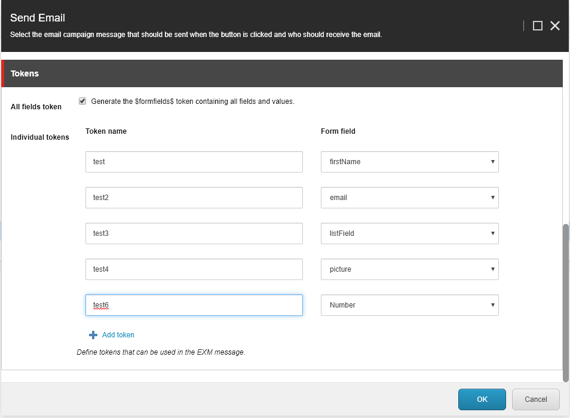

=======================================================
Create an automated message in Email Experience Manager
=======================================================

The "Send Email" submit action works in collaboration with Email Experience Manager (EXM).

Learn here, how to setup an email to be used for the send mail action.

Creating a new automated campaign
=================================

First, go to Email Experience Manager and create a new automated message.

.. image:: SFE-EmailFixed-ExmCreateCampaign.png

Take any of the available templates. In the best case, some custom tailored templates are provided by the developers for your site.

.. image:: SFE-EmailFixed-ExmChooseTemplate.png

Fill in the general info like “from” name and email.

.. image:: SFE-EmailFixed-ExmGeneralInfo.png

Use the template to fill in the body of your email message.

.. image:: SFE-EmailFixed-ExmMessage.jpg

Finally, we need to activate the message in the delivery tab. 
Only activated message will be available to use on the "Send Mail" action.

.. image:: SFE-EmailFixed-ExmActivate.png

Using form values in the email
==============================

To print the form data entered by the visitor in the email, you must use tokens.
These tokens will be replaced with the actual values when someone submits the form and an email gets send out.

The form fields can be referenced individual, field per field, or you can use one token that will print all values from the form in one token.

Using individual tokens
-----------------------

Define your tokens when using the Send Email action:

The Token name can be used in your EXM message.

So in this case this would be **$test$**.

Print all field values with one token
-------------------------------------

Use the token **$AllFormFields$** to print all fields with their value in the email.

