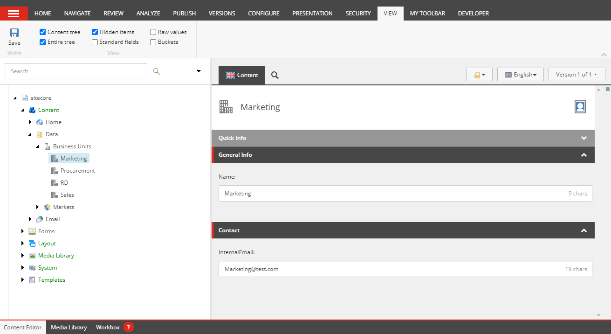
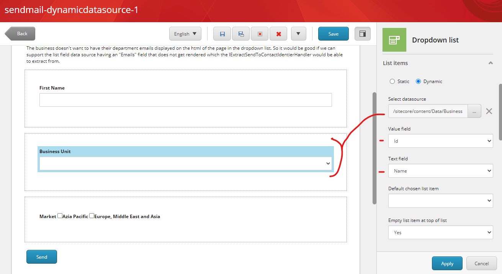
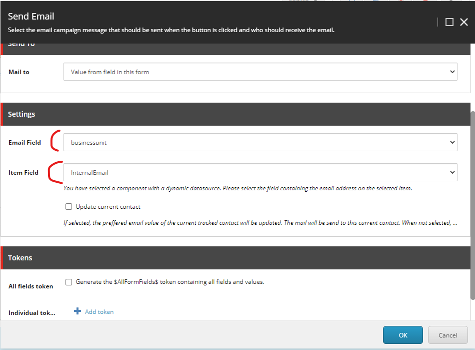

========================
Send to form field value
========================

Use this option to email the visitor that has filled in the form.

Choose mailto “Value from field in form”

Choose one of the fields of the form. This field must contain an email address. 
It can be a free email field for the visitor to enter it’s email address or it could also be a dropdown with choices that have an email as value. 
(For example if you want to mail to a different department based on a chosen topic).

.. image:: form-12-dialog-formfield.png

With this option you can also check the "update current contact" checkbox.

When you check this box, then upon submittion, the current session will be updated with the value from the chosen field.
This session will then become identified instead of anonymous. (If the session was already identified, the email will just be updated in the profile.

When this box is not checked, we will lookup if there is a contact with the provided email address.
If we find a contact, we will use this contact, if not, a new contact will be created.

Selecting the email-address from a list component
=================================================

When you select a list-component with a **dynamic datasource** as the email adress source, you can now select which field to use from the asset. 
By doing so, you can prevent internal email addresses being send to the visitor.

Example:
--------

1. A list of business units is defined in Sitecore. Each unit has a name and an internal email address.

2. On the form, a dropdownlist is added, with the list of business units as dynamic datasource.
The item id is used as the value field (and send to the visitor in the html), the name field of the item is used to display to the visitor.

3. On the send-email submit action, the businessunit drowdownlist component is chosen as the email source. We select the "InternalEmail" fied as the field containing the actual email address.

