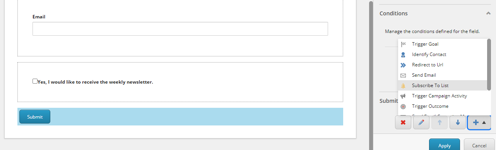
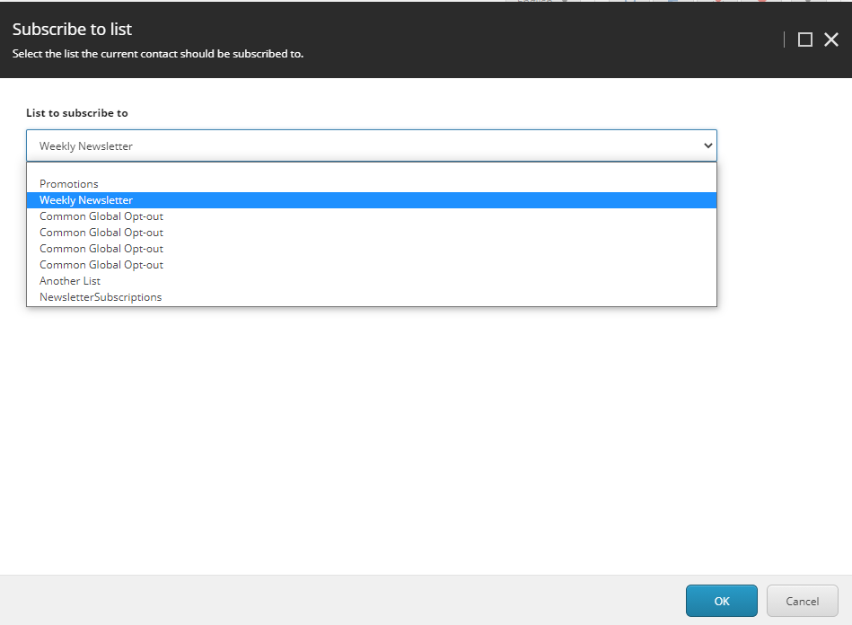
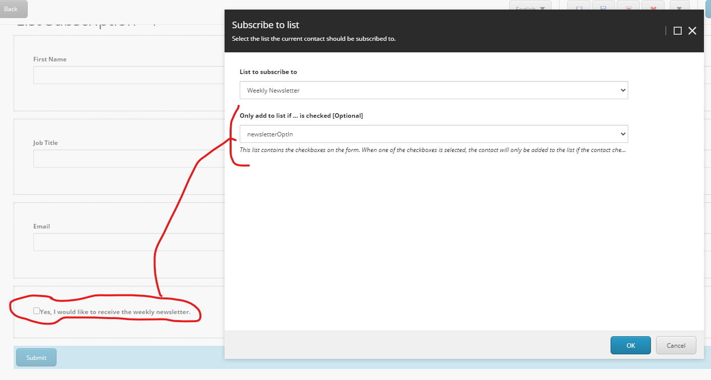

=================
Subscribe to list
=================

With the "Subscribe to list" submit action, the current contact can be added to a list of contacts.

The action works in collaboration with the List Manager. Only standard contact lists are supported, you cannot directly add a contact to a segmented list.

How to use the Subscribe to list action
=======================================

On the submit button in your fomr, go to submit actions and add the subscribe to list address action.

Next, select the list to subscribe the contact to.

Add a checkbox condition (optional)
===================================

If you only want to subscribe to contact to the list when a certain checkbox in the form has been checked by the contact on the form, 
you can do this by linking the checkbox to the subscribe to list action.

