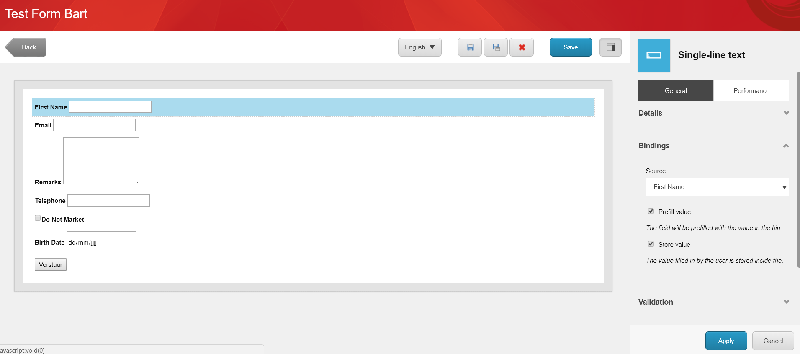
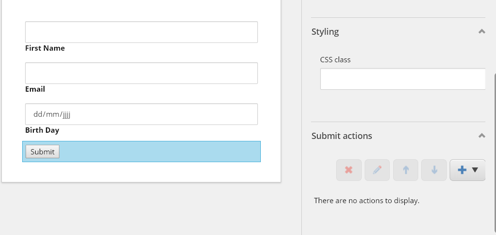

.. _FormBindings:

==========================
Form Bindings (Prefilling)
==========================

With the form bindings, you an prefill fields in your form based on xDB contact data. 
The form bindings also support to store the data entered in the form on your xDB contact.

Note: For security reasons it might be prudent to limit prefilling to forms behind a login. 
Storing info on the profile is less sensitive and can be used on forms without login. 
More info on https://www.campaignion.org/blog/all-you-have-know-about-pre-filling-forms

How to configure a field
========================

In the forms editor, select the field you wish to prefill.

Check the "Bindings" section in the panel on the right.

Source
------
**Mandatory**

In the source field, you must select what source you want to link the field to. 
The prefill value of the form will be fetched form this source.

.. image:: fieldbindings/fieldbindings-choose-field.png

Prefill Value
--------------
**Optional**

Check the "prefill value" checkbox in order to prefill this field with the selected source.

Store Value
-----------
**Optional**

Check the "store value" checkbox in order to save the value entered by the visitor in the form to the selected source.

Supported Form Elements
=======================

This functionality is available for form elements of the type:
 - Single-Line Text
 - Multi-line Text
 - Number
 - Email
 - Hidden
 - Telephone
 - Checkbox
 - Date

Example
=======

Build Form
----------

Let’s create a new form with 3 fields:

FirstName
  We will prefill this from the xDB profile and store it back upon form submition

.. image:: fieldbindings/databinding-ex-step1.png

Email
  We will prefill this from the xDB profile and store it back upon form submition

.. image:: fieldbindings/databinding-ex-step2.png

Birthday
  We will only store the value, but not prefill it

.. image:: fieldbindings/databinding-ex-step3.png

Finally we will add a submit button with no submit actions attached. 
(just for the example, it is perfectly possible to add submit actions)

Finish by putting the form on a page and test it.

Testing
-------

Let’s visit the form now.

Considering a new first time visitor, the form will be empty, since there is no data on his xDB profile yet.

.. image:: fieldbindings/form-empty.png

The visitor fills in the form and submit’s. The data entered will now be stored in the selected xDB fields.

.. image:: fieldbindings/form-data.png

The visitors revisits the form (or any other form configured with data binding), the fields first name and email will be prefilled with the data form the xDB profile. 

.. image:: fieldbindings/form-prefilled.png
